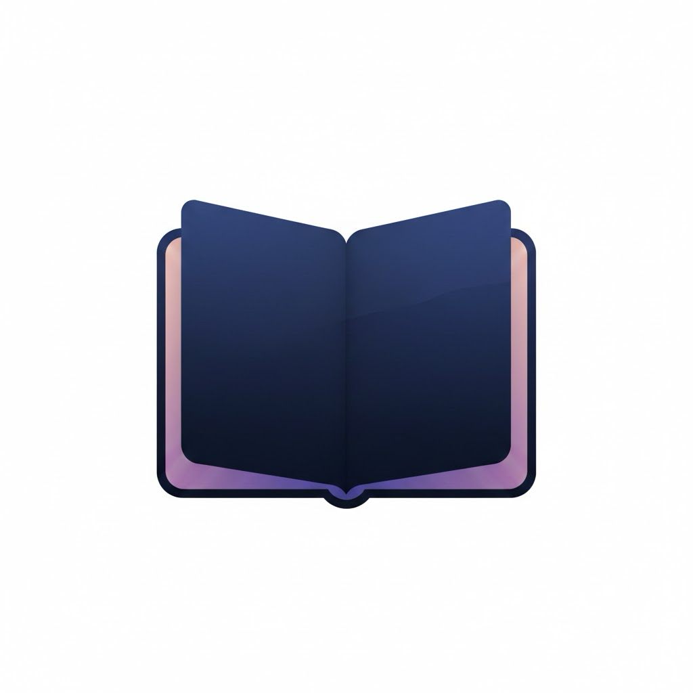

<p align="center">
  
</p>

<h1 align="center">MINT</h1>

<p align="center">
  <strong>Meeting Intelligence Notes &amp; Transcription</strong>
</p>

<p align="center">
  A macOS desktop app that captures audio during meetings, transcribes in real time, and generates structured notes with AI.
</p>

<p align="center">
  <a href="#"></a>
  <a href="#"></a>
  <a href="#"></a>
  <a href="#"></a>
</p>

---

## Overview

MINT records meetings with a single click. It captures both your **microphone** and **system audio** as separate streams, transcribes them in real time using [Deepgram](https://deepgram.com), and lets you generate structured meeting notes powered by [OpenAI GPT-4o](https://openai.com) or a local [Ollama](https://ollama.com) model.

Everything is stored locally on your machine as Markdown files — no cloud storage, no subscriptions, your data stays yours.

## Features

- **Dual audio capture** — Records microphone and system audio simultaneously via separate streams
- **Real-time transcription** — Live transcript feed with speaker labels as the meeting happens
- **AI-powered notes** — Generate executive summaries, decisions, and action items on demand
- **Local-first storage** — Meetings saved as Markdown files in a folder you choose
- **Cloud or local AI** — Use OpenAI GPT-4o or run completely offline with Ollama
- **Meeting organization** — Auto-sorted by date (Today, Yesterday, This Week…) with custom sections
- **Drag-and-drop** — Move meetings between sections to organize however you like
- **Color tags** — Tag meetings with customizable colored labels
- **Transcript search** — Full-text search across all transcript entries
- **Dark theme** — Native macOS look with a polished dark interface

## How It Works

```
┌─────────────┐     ┌──────────────┐     ┌─────────────┐     ┌──────────────┐
│  Microphone  │────▶│              │────▶│  Deepgram   │────▶│              │
│   (16kHz)    │     │   Electron   │     │  WebSocket  │     │  Live        │
│              │     │   Main       │     │  (nova-2)   │     │  Transcript  │
│ System Audio │────▶│   Process    │────▶│  WebSocket  │────▶│              │
│   (16kHz)    │     │              │     │  (nova-2)   │     │              │
└─────────────┘     └──────────────┘     └─────────────┘     └──────┬───────┘
                                                                     │
                                                                     ▼
                                                              ┌──────────────┐
                                                              │  OpenAI /    │
                                                              │  Ollama      │
                                                              │  ──────────  │
                                                              │  Summary     │
                                                              │  Decisions   │
                                                              │  Actions     │
                                                              └──────────────┘
```

1. **Start recording** — Click the record button in the app
2. **Audio capture** — Mic audio via Web Audio API, system audio via [AudioTee](https://github.com/nicktmro/AudioTee), both downsampled to 16kHz linear16 PCM
3. **Streaming transcription** — Two parallel Deepgram WebSocket connections (mic labeled with your name, system audio labeled "Meeting Users")
4. **Live display** — Transcript entries appear in real time with speaker and timestamp
5. **Stop & save** — Transcript saved as Markdown to your chosen storage folder
6. **Generate notes** — Hit the generate button to produce structured notes via GPT-4o or Ollama

## Getting Started

### Prerequisites

- **macOS** (required — uses macOS-specific audio capture)
- **Node.js** 18+
- **Deepgram API key** ([get one free](https://console.deepgram.com))
- **OpenAI API key** (optional — can use Ollama instead)

### Installation

```bash
# Clone the repository
git clone https://github.com/your-username/mint.git
cd mint

# Install dependencies
npm install
```

### Development

```bash
npm run dev          # Start with hot reload
```

### API Keys

No `.env` file or manual configuration needed. Add your API keys directly in the app's **Settings** panel:

1. Open MINT and go to **Settings** from the sidebar
2. Enter your **Deepgram API key** under Transcription
3. Enter your **OpenAI API key** under Notes Generation (or configure Ollama instead)

### Build

```bash
npm run build:mac    # Build macOS DMG
```

The packaged `.dmg` will be in the `dist/` directory.

## Usage

### First Launch

On first launch, MINT will ask for your **display name** (used to label your mic audio in transcripts) and a **storage folder** (defaults to `~/Documents/MINT`).

### Recording a Meeting

1. Click **Start Recording**
2. Watch the live transcript as people speak
3. Click **Stop** when the meeting ends
4. Open the meeting from the sidebar to view the full transcript

### Generating Notes

Open any completed meeting and click **Generate Notes** on the Summary tab. MINT will send the transcript to your configured AI provider and produce:

- **Executive Summary** — 2-4 paragraph overview of the meeting
- **Decisions** — Key decisions that were made
- **Action Items** — Tasks with optional assignees and due dates

You can regenerate notes at any time.

### Organizing Meetings

- Meetings auto-sort into date sections (Today, Yesterday, This Week, This Month, Older)
- Create **custom sections** with the + button to organize by project, team, or topic
- **Drag meetings** between sections using the grip handle on each card
- **Tag meetings** with colored labels — customize tag names in Settings
- **Rename** meetings or sections by double-clicking their titles

### Settings

Access settings from the sidebar to configure:

| Setting | Description |
|---------|-------------|
| Display Name | Your name shown on mic transcripts |
| Microphone | Select audio input device |
| Deepgram Key | API key for transcription |
| AI Provider | Toggle between OpenAI and Ollama |
| OpenAI Key | API key for note generation |
| Ollama URL | Endpoint for local Ollama instance |
| Tags | Rename the four color tag labels |
| Storage | Change where meetings are saved |

## Local Storage

MINT stores everything as plain files — no database required:

```
~/Documents/MINT/
├── meeting-abc123/
│   ├── metadata.json       # Title, status, dates, tags
│   ├── transcript.md       # Timestamped speaker entries
│   └── notes.md            # AI-generated summary & actions
├── meeting-def456/
│   └── ...
└── tags.json               # Custom tag definitions
```

Transcripts and notes are standard Markdown — open them in any text editor, back them up however you want.

## Tech Stack

| Layer | Technology |
|-------|-----------|
| Desktop | [Electron](https://www.electronjs.org/) 39 |
| Frontend | [React](https://react.dev/) 19 + TypeScript 5.9 |
| Build | [electron-vite](https://electron-vite.org/) + [Vite](https://vite.dev/) 7 |
| Transcription | [Deepgram](https://deepgram.com/) nova-2 (streaming WebSocket) |
| Notes | [OpenAI](https://openai.com/) GPT-4o / [Ollama](https://ollama.com/) |
| System Audio | [AudioTee](https://github.com/nicktmro/AudioTee) |
| Packaging | [electron-builder](https://www.electron.build/) (DMG) |

## Architecture

```
src/
├── main/                        # Electron main process
│   ├── index.ts                 # Window creation, app lifecycle
│   ├── ipc-handlers.ts          # IPC orchestration for recording lifecycle
│   └── services/
│       ├── audio-capture.ts     # Renderer audio coordination
│       ├── audiotee.ts          # System audio capture (macOS)
│       ├── deepgram.ts          # Streaming WebSocket transcription
│       ├── openai.ts            # GPT-4o / Ollama note generation
│       └── local-storage.ts     # File-based meeting storage
├── preload/
│   └── index.ts                 # Context bridge + audio pipeline
└── renderer/src/
    ├── App.tsx                  # Root component with sidebar routing
    ├── components/
    │   ├── AudioSetup.tsx       # Onboarding flow
    │   ├── LiveRecording.tsx    # Real-time transcript view
    │   ├── MeetingList.tsx      # Dashboard with sections
    │   ├── MeetingCard.tsx      # Meeting preview card
    │   ├── MeetingDetail.tsx    # Summary + transcript tabs
    │   ├── Settings.tsx         # Configuration panel
    │   └── TagPicker.tsx        # Color tag selector
    └── styles/global.css        # Dark theme
```

## Contributing


## License

This project is licensed under the MIT License. See [LICENSE](LICENSE) for details.
